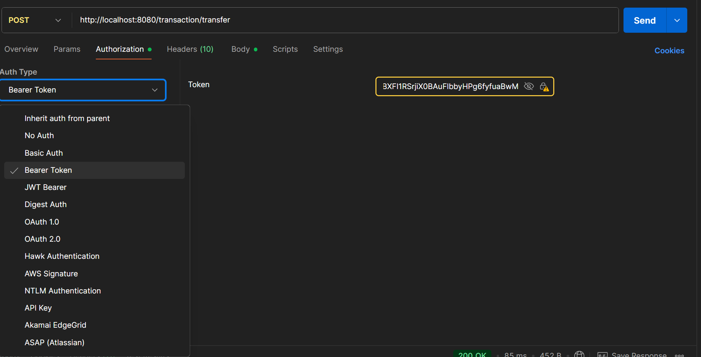
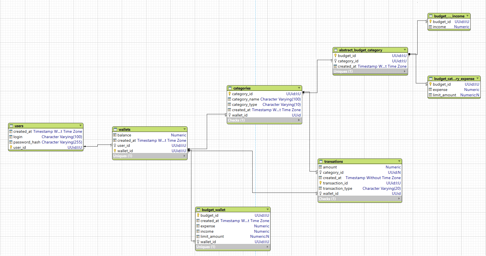
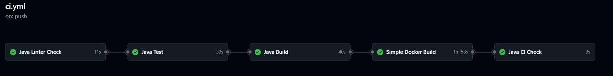

# Проект для управления личными финансами

## 👉 Стек:
  - Java 21
  - PostgreSQL
  - Spring Boot
  - Maven
  - JUnit
  - Jackson
  - lombok
  - Hibernate

## 👉 Запуск:
1. Через Maven сборку:
- git clone https://github.com/Timon27M/Personal-finances.git
- В postgres (pgAdmin) создать БД с название finance_db
- mvn clean package
- java -jar .\target\main-0.0.1-SNAPSHOT.jar
2. Через docker сборку
- git clone https://github.com/Timon27M/Personal-finances.git
- В postgres (pgAdmin) создать БД с название finance_db
- docker-compose up --build
3. Напрямую через ide

## 👉 Ссылка на postman где уже созданы основные эндпоинты для тестирования api:

- https://www.postman.com/tim2772/my-workspace/collection/34108112-c53d7963-430f-4da0-8c30-2259ec991da7/?action=share&creator=34108112

## 👉 Описание эндпоинтов
BASE_PATH = http://localhost:8080

<u>Для всех запросов отличных от http://localhost:8080/auth/... необходимо передавть токен в authorization Bearer Token</u>

**Данный токен нужен для распознания программой определенного пользователя, так как токен шифрует UUID пользователя.**
Токен действителен 24 часа

### 1. /auth/register (POST) - регистрация пользователя 
- Регистрирует пользователя создавая необходимые данные в БД
- На вход: {
  "login": String,
  "password": String
  }
- На выход: {
  "userId": UUID,
  "login": String
  }
### 2. /auth/login (POST) - авторизация пользователя 
- Авторизирует пользователя отдавая ему accessToken, который впоследствии используется для обращения ко всем запросам доступным авторизированному пользователю.
- На вход: {
  "login": String,
  "password": String
  }
- На выход: {
  "token": String
  }
### 3. /wallet/info (GET) - получение всех данных о кошельке пользователя
- Отдает пользователю всю информацию о кошельке
- Для запроса необходимо передать в authorization Bearer Token, который можно получить при авторизации.
- На вход: -
- На выход: {
  "balance": BigDecimal,
  "walletExpense": BigDecimal,
  "walletIncome": BigDecimal,
  "expenseCategories": List<CategoryInfoExpense>,
  "incomeCategories": List<CategoryInfoIncome>,
  "status": Integer
  }

### 4. /wallet/limit-amount (POST) - обновление лимита кошелька
- Обновляет limit кошелька
- Для запроса необходимо передать в authorization Bearer Token, который можно получить при авторизации.
- На вход: {
  "limitAmount": BigDecimal
  }
- На выход: {
  "message": String,
  "status": Integer,
  "timestamp": LocalDateTime
  }
- 
### 5. /wallet/limit-amount/category (POST) - обновление лимита на определенную категорию
- Обновляет limit на категорию
- Для запроса необходимо передать в authorization Bearer Token, который можно получить при авторизации.
- На вход: {
  "categoryName": String,
  "newLimitAmount": BigDecimal
  }
- На выход: {
  "message": String,
  "status": Integer,
  "timestamp": LocalDateTime
  }

### 6. /wallet/category (DELETE) - Удаление категории
- Удаляет категорию 
- Для запроса необходимо передать в authorization Bearer Token, который можно получить при авторизации.
- На вход: {
  "categoryName": String,
  "type": String
  }
- На выход: {
  "message": String,
  "status": Integer,
  "timestamp": LocalDateTime
  }

### 7. /transaction/add-income (POST) - добавление дохода
- Увеличивает баланс кошелька создавая категорию на определенный доход
- Для запроса необходимо передать в authorization Bearer Token, который можно получить при авторизации.
- На вход: {
  "categoryName": String,
  "amount": BigDecimal
  }
- На выход: {
  "message": String,
  "status": Integer,
  "timestamp": LocalDateTime
  }

### 8. /transaction/add-expense (POST) - добавление расход
- Уменьшкает баланс кошелька создавая категорию на определенный расход
- Для запроса необходимо передать в authorization Bearer Token, который можно получить при авторизации.
- На вход: {
  "categoryName": String,
  "amount": BigDecimal
  }
- На выход: {
  "message": String,
  "status": Integer,
  "timestamp": LocalDateTime
  }

### 9. /transaction/history (GET) - История транзакций
- Выводит историю транзакций
- Для запроса необходимо передать в authorization Bearer Token, который можно получить при авторизации.
- На вход: -
- На выход: {
  "transactions": LIST<{
  "transactionId": String,
  "amount": BigDecimal,
  "categoryName": String,
  "type": String
   }>
  }

### 10. /transaction/transfer (POST) - перевод средств на счет другого пользователя
- Переводит средства на другой кошелек
- Для запроса необходимо передать в authorization Bearer Token, который можно получить при авторизации.
- На вход: {
  "loginRecipient": String,
  "amount": BigDecimal
  }
- На выход: {
  "message": String,
  "status": Integer,
  "timestamp": LocalDateTime
  }

## 👉 Архитектура (основные компоненты)
- Entity: Хранит сущность каждой таблицы в БД
- Repository: служит для обращения к таблице в БД
- Service: Соодержит бизнес логику
- Controller: Принимает запрос пользователя, вызывает бизнес логику, отдает результат пользователю.
- Security: Пердварительно обрабатывает запросы не пропуская неавторизованых пользователей
- dto: Хранит обьекты запросов и ответов к api

## 👉 Связи между сущностями

## 👉 Тестирование 
В проекте протестированны основной функционал services

__API обрабавтывает все ошибки и выводит информацию пользователю__

## 👉 CI/CD
- При каждем push репозиторий запускается jobs

__Не давая выполнить merge в main пока все шаги не пройдут успешно__